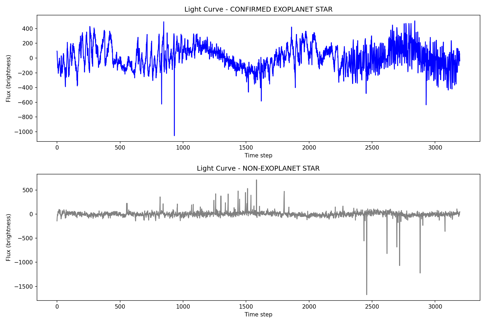
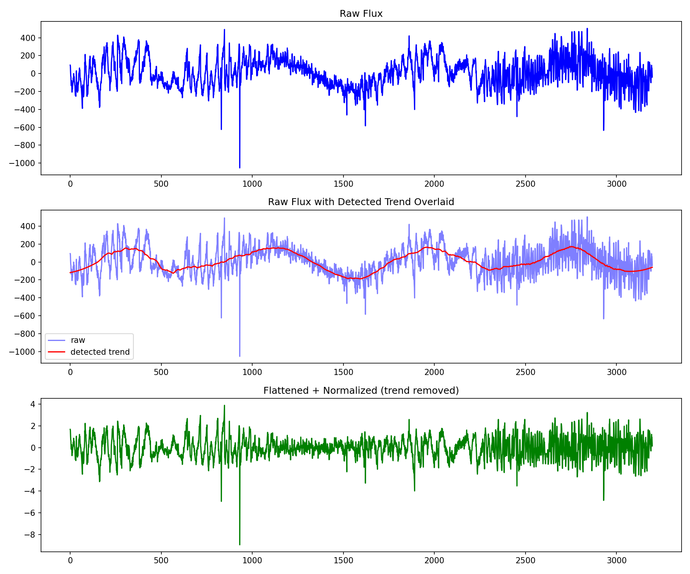
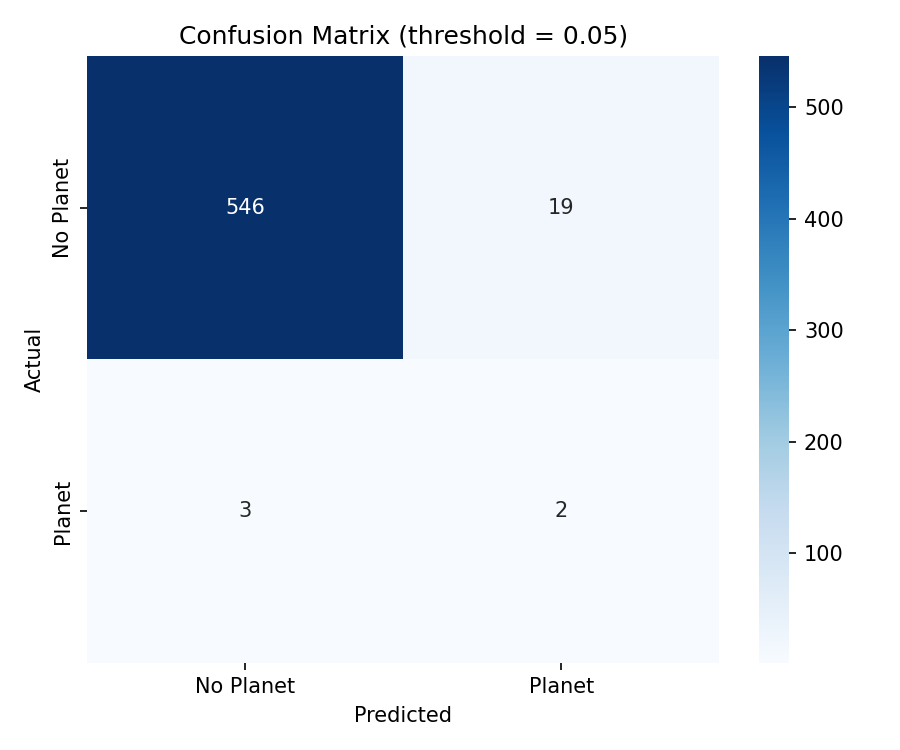
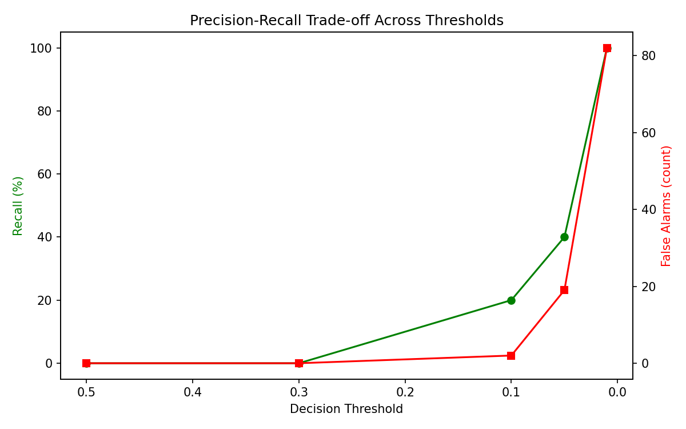

# 🪐 Exoplanet Detection Using Deep Learning

[](https://www.python.org/)
[](https://www.tensorflow.org/)
[](LICENSE)

A 1D Convolutional Neural Network that classifies stars as hosting a confirmed
exoplanet or not, using real NASA Kepler brightness (light curve) data — and
an honest walkthrough of what happens when you train on a severely imbalanced
astronomical dataset (37 positives out of 5,087 stars).

## Table of Contents
- [Problem](#problem)
- [Dataset](#dataset)
- [Approach](#approach)
- [Results](#results)
- [Key Insight: Why Accuracy Lies](#key-insight-why-accuracy-lies)
- [How to Run](#how-to-run)
- [Repo Structure](#repo-structure)
- [Improvements](#improvements)

## Problem
When a planet passes in front of its star (a "transit"), it blocks a tiny
fraction of the star's light, causing a small periodic dip in brightness.
This project trains a CNN to recognize that dip pattern automatically from
raw Kepler telescope data — the same approach used in Google/UT Austin's
**AstroNet** research (Shallue & Vanderburg, 2018), which discovered two real
exoplanets missed by earlier methods.



## Dataset
[Kaggle: Exoplanet Hunting in Deep Space](https://www.kaggle.com/datasets/keplersmachines/kepler-labelled-time-series-data)
(NASA Kepler mission data)

| | Rows | Confirmed exoplanets | Imbalance |
|---|---|---|---|
| Train | 5,087 | 37 | 0.73% |
| Test | 570 | 5 | 0.88% |

Each row = one star's brightness measured at 3,197 points in time.

## Approach
1. **Preprocessing** — Detrended each light curve with a Savitzky-Golay
   filter to remove slow stellar-variability drift, then z-score normalized.
   
2. **Model** — 3-block Conv1D + MaxPooling1D CNN → dense layers → sigmoid
   output. ~210K parameters. Built in TensorFlow/Keras.
3. **Imbalance handling** — `class_weight="balanced"` during training,
   penalizing missed exoplanets ~137x more than misclassified non-planets.
4. **Training** — Adam optimizer, binary cross-entropy loss, early stopping
   on validation loss.

## Results

| Metric | Score |
|---|---|
| **AUC-ROC** | **0.95** |
| Recall @ threshold 0.5 (default) | 0% |
| Recall @ threshold 0.05 (tuned) | 40% |
| Recall @ threshold 0.01 (aggressive) | 100% |




## Key Insight: Why Accuracy Lies
A model that predicts "no exoplanet" for every single star scores **99.27%
accuracy** on this dataset — while catching zero real planets. This project
deliberately surfaces that failure mode instead of hiding it: the model's
**0.95 AUC-ROC** proves it learned genuine structure, but the **default
threshold gave 0% recall**, which I diagnosed and fixed through threshold
tuning — trading a small, controlled increase in false positives for a large
gain in real planets caught. This mirrors the actual trade-off astronomers
face: false positives cost follow-up telescope time, but a missed real planet
is gone for good.

## How to Run
```bash
git clone https://github.com/SriRahulP/exoplanet-detection-cnn.git
cd exoplanet-detection-cnn
pip install -r requirements.txt
```
Download `exoTrain.csv` and `exoTest.csv` from the
[Kaggle dataset link above](https://www.kaggle.com/datasets/keplersmachines/kepler-labelled-time-series-data)
and place them in `data/`.

```bash
python src/preprocessing.py   # builds and saves processed arrays
python src/train.py           # trains and saves the model
python src/evaluate.py        # evaluates across thresholds
```

## Repo Structure
```
exoplanet-detection-cnn/
├── data/                 # place downloaded CSVs here (not committed)
├── src/
│   ├── explore_data.py
│   ├── preprocessing.py
│   ├── train.py
│   └── evaluate.py
├── assets/               # plots used in this README
├── requirements.txt
└── README.md
```

## Improvements
- Phase-fold light curves using a detected orbital period (Box Least
  Squares algorithm) — the full AstroNet approach — to further separate
  signal from noise.
- Dual-branch CNN using both a global and a local view of the folded curve.
- SMOTE or synthetic oversampling to address the imbalance more directly
  during training rather than only via loss weighting.

## Tech Stack
Python · TensorFlow/Keras · NumPy · Pandas · SciPy · scikit-learn ·
Matplotlib · Seaborn
